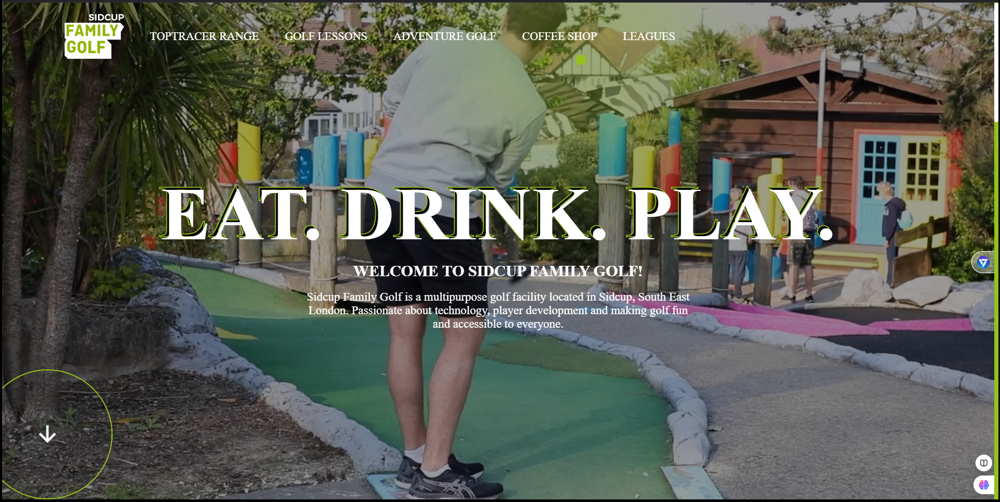

# 🏌️ Golf Landing Page

## 📋 Description
Golf Landing Page is a visually appealing and responsive single-page website designed as a clone of the [Sidcup Family Golf](https://sidcupfamilygolf.com/) website. This project demonstrates skills in web design and development, focusing on creating a professional and user-friendly interface that highlights golfing facilities, services, and events.

The landing page is built with modern frontend technologies, ensuring smooth navigation and an engaging user experience.

## 🌐 Project Links
- **Live Demo:** [Golf Landing Page](https://golfpageclone.netlify.app/)

## ✨ Features
- 🎨 **Modern Design:** Aesthetic and responsive layout optimized for all devices.

## 📚 Usage
1. Clone the repository:
   ```bash
   git clone https://github.com/Arrk01/Golf.git

2. Open the `index.html` file in any browser to view the landing page.

## 🛠️ Technologies Used
- 🖥️ **HTML5**
- 🎨 **CSS3**
- 🌐 **JavaScript**
- 🔧 **Bootstrap** (optional, for responsive design)

## 📸 Screenshots
### Photo:


## 📝 License
This project is licensed under the MIT License - see the [LICENSE](./LICENSE) file for details.

---
Feel free to explore, share, or contribute to this project! 🚀
